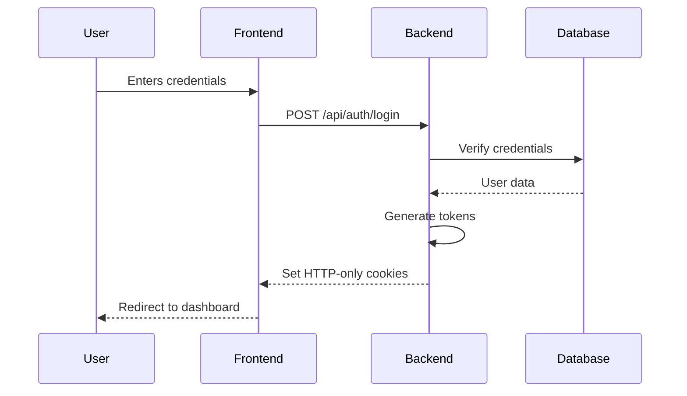

# Session Management

This document outlines the session management strategy for ScriptGenius, including authentication flows, token handling, and security measures.

## Table of Contents
- [Architecture Overview](#architecture-overview)
- [Authentication Flow](#authentication-flow)
- [Token Management](#token-management)
- [Session Security](#session-security)
- [Revocation](#revocation)
- [Rate Limiting](#rate-limiting)
- [Audit Logging](#audit-logging)

## Architecture Overview

### Components

1. **Frontend**
   - Session state management
   - Token storage (HTTP-only cookies)
   - Automatic token refresh
   - Inactive session detection

2. **Backend**
   - JWT validation
   - Refresh token rotation
   - Session storage (Redis)
   - Rate limiting

3. **Database**
   - Session records
   - Active sessions per user
   - Revocation list

## Authentication Flow

### Login



### Token Refresh

```typescript
// lib/auth/token.ts
interface Tokens {
  accessToken: string;
  refreshToken: string;
  expiresIn: number;
}

async function refreshTokens(refreshToken: string): Promise<Tokens> {
  const response = await fetch('/api/auth/refresh', {
    method: 'POST',
    credentials: 'include',
    headers: {
      'Content-Type': 'application/json',
    },
    body: JSON.stringify({ refreshToken }),
  });

  if (!response.ok) {
    throw new Error('Failed to refresh tokens');
  }

  return response.json();
}
```

## Token Management

### Access Token
- **Type**: JWT
- **Lifetime**: 15 minutes
- **Storage**: HTTP-only cookie
- **Claims**:
  ```typescript
  interface AccessTokenPayload {
    sub: string;      // User ID
    role: string;     // User role
    iat: number;      // Issued at
    exp: number;      // Expiration time
    jti: string;      // Unique token ID
  }
  ```

### Refresh Token
- **Type**: Opaque token
- **Lifetime**: 7 days
- **Storage**: HTTP-only cookie
- **Features**:
  - Single-use
  - Rotation on use
  - Server-side revocation

## Session Security

### Cookie Settings
```typescript
const cookieOptions = {
  httpOnly: true,
  secure: process.env.NODE_ENV === 'production',
  sameSite: 'lax' as const,
  path: '/',
  maxAge: 60 * 60 * 24 * 7, // 7 days
};
```

### Security Headers
```typescript
// next.config.js
const securityHeaders = [
  {
    key: 'Strict-Transport-Security',
    value: 'max-age=63072000; includeSubDomains; preload'
  },
  {
    key: 'X-Content-Type-Options',
    value: 'nosniff'
  },
  {
    key: 'X-Frame-Options',
    value: 'DENY'
  },
  {
    key: 'X-XSS-Protection',
    value: '1; mode=block'
  }
];
```

## Revocation

### Logout Flow
1. Invalidate current session
2. Clear client-side tokens
3. Add token to revocation list
4. Clear HTTP-only cookies

```typescript
// pages/api/auth/logout.ts
import { NextApiRequest, NextApiResponse } from 'next';
import { createServerSupabaseClient } from '@supabase/auth-helpers-nextjs';

export default async function handler(
  req: NextApiRequest,
  res: NextApiResponse
) {
  const supabase = createServerSupabaseClient({ req, res });
  
  // Sign out from Supabase
  await supabase.auth.signOut();
  
  // Clear cookies
  res.setHeader('Set-Cookie', [
    `sb-access-token=; Path=/; HttpOnly; SameSite=Lax; Max-Age=0`,
    `sb-refresh-token=; Path=/; HttpOnly; SameSite=Lax; Max-Age=0`,
  ]);
  
  return res.status(200).json({ success: true });
}
```

## Rate Limiting

### Login Attempts
- 5 attempts per 5 minutes per IP
- 10 attempts per hour per account
- 100 requests per minute per IP for auth endpoints

### Implementation
```typescript
// lib/rate-limit.ts
import { RateLimiterMemory } from 'rate-limiter-flexible';

const loginRateLimiter = new RateLimiterMemory({
  points: 5,           // 5 attempts
  duration: 5 * 60,    // per 5 minutes
  blockDuration: 1800, // block for 30 minutes after limit
});

export async function checkRateLimit(ip: string, key: string) {
  try {
    await loginRateLimiter.consume(`${ip}:${key}`);
    return { allowed: true };
  } catch (e) {
    return { 
      allowed: false, 
      retryAfter: Math.ceil((e as any).msBeforeNext / 1000) 
    };
  }
}
```

## Audit Logging

### Logged Events
- Login attempts (success/failure)
- Password changes
- MFA enrollment/changes
- Session creation/termination
- Suspicious activity

### Log Format
```typescript
interface AuditLogEntry {
  id: string;
  userId: string | null;
  action: string;
  ipAddress: string;
  userAgent: string;
  metadata: Record<string, any>;
  createdAt: Date;
  status: 'success' | 'failure' | 'warning';
}
```

### Retention Policy
- 90 days for successful events
- 1 year for security-related events
- 7 days for debug logs
